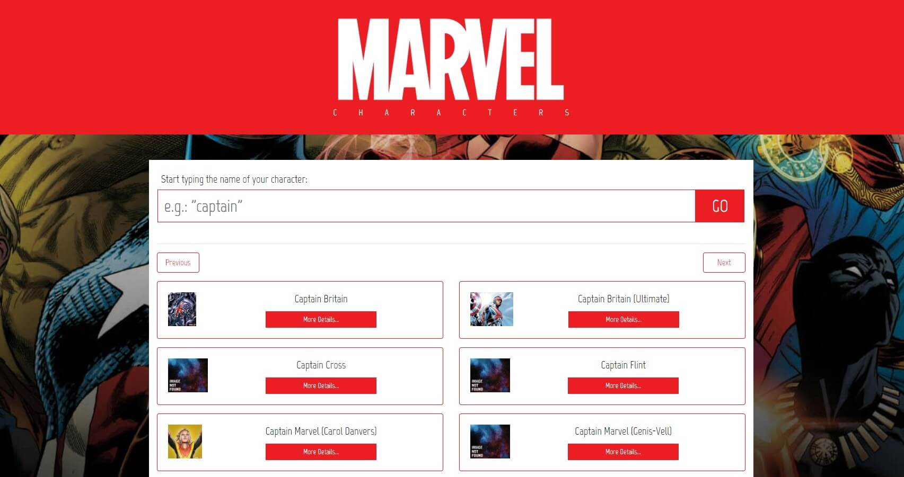

<h1 align="center">
  :izakaya_lantern: Marvel Characters Search App
</h1>

<p align="center">
  <a href="#pencil-objectives">Objectives</a>&nbsp;&nbsp;&nbsp;|&nbsp;&nbsp;&nbsp;
  <a href="#trophy-lessons-learned">Lessons Learned</a>&nbsp;&nbsp;&nbsp;|&nbsp;&nbsp;&nbsp;
  <a href="#rocket-technologies--resources">Technologies</a>&nbsp;&nbsp;&nbsp;|&nbsp;&nbsp;&nbsp;
  <a href="#hammer-setting-up-the-environment">Environment Setup</a>
</p>

<p align="center">
  

  

  

  

  
</p>



This application was proposed by [Juno](https://www.juno.com.br/), as part of their recruitment process for frontend developers. The challenge was to build a fully responsive client application in React to consume [Marvel API](https://developer.marvel.com/docs#!/public/getCreatorCollection_get_0), searching for characters and being able to display their details when selected.

[Check out the application running!](https://the-marvel-characters.vercel.app/)

## :pencil: Objectives

- [x] Display a search input for the user to query API based on  `nameStartsWith`;
- [x] Display search result (summarized);
- [x] When opening an item, display its details;
- [x] Display responsive thumbnails (that better fits the screen) for the items which has it;
- [x] Interface MUST be responsive;
- [x] The final project must contain a `.MD` file with specifications of the project.
- [x] Develop the application using React and Node.js (with ES6+)

### Optional bonus

- [x] Pagination;
- [x] SASS (implemented for Bootstrap and additional styles customization);
- [ ] Transitions;
- [x] Project watchers and routines with Node.js and other environmental utilities;
- [ ] Unit tests by componnent.

## :trophy: Lessons Learned

- Communicate with [Marvel API](https://developer.marvel.com/);
- Build a React.js (first app ever);
- Overwrite Bootstrap defaults with SASS;
- React with TypeScript (at version 1.1);
- React Hooks (at version 1.1);

## :rocket: Technologies & Resources

**Frontend:**
- [React ~~16.9~~17](https://reactjs.org)
- [Bootstrap 4](https://getbootstrap.com/)
- [jQuery 3](https://jquery.com/)
- [Axios](https://github.com/axios/axios) (HTTP client)

**Development:**
- [Visual Studio Code](https://code.visualstudio.com/)
- [Cmder](https://cmder.net/) (terminal emulator)
- [Node.js](https://nodejs.org/en/) scripts (with Laravel Mix)

## :hammer: Setting up the Environment

Make sure to have **Node.js 14+** installed in your machine and **yarn** (**npm** will do the job as well) available in the command line, then use the following command to install dependencies:

```bash
$ yarn   # or "npm install"
```

To execute the application, you must have a Marvel Developer account and have the **public** and **private** keys generated. Once you have them, you will have to register both as environment variables in a `.env` file, at project root. If it wasn't created after installation process, use `.env.example` as reference to know all the required variables to be set.

At last, you can use the following commands to run the application:

```bash
$ yarn dev     # run development server
$ yarn build   # build files for production
```
