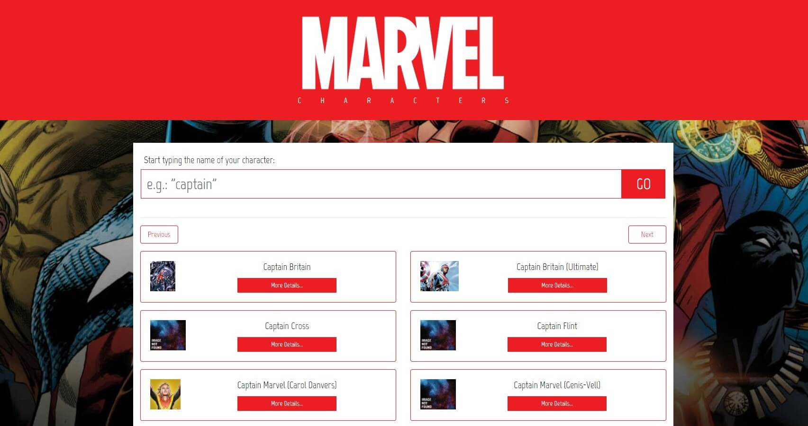

<h1 align="center">
  :izakaya_lantern: Marvel Characters Search App
</h1>

- **Project developed by:** [Julio L. Muller](https://github.com/juliolmuller)
- **Released on:** Jul 31, 2019
- **Updated on:** Aug 25, 2020
- **Latest version:** 1.1.0
- **License:** MIT



This application was proposed by [Juno](https://www.juno.com.br/), as part of their recruitment process for frontend developers. The challenge was to build a fully responsive client application in React to consume [Marvel API](https://developer.marvel.com/docs#!/public/getCreatorCollection_get_0), searching for characters and being able to display their details when selected.

[Check out the application running!](https://juliolmuller.github.io/marvel-characters/)

## :pencil: Objectives

- :heavy_check_mark: Display a search input for the user to query API based on  `nameStartsWith`;
- :heavy_check_mark: Display search result (summarized);
- :heavy_check_mark: When opening an item, display its details;
- :heavy_check_mark: Display responsive thumbnails (that better fits the screen) for the items which has it;
- :heavy_check_mark: Interface MUST be responsive;
- :heavy_check_mark: The final project must contain a `.MD` file with specifications of the project.
- :heavy_check_mark: Develop the application using React and Node.js (with ES6+)

### Optional bonus

- :heavy_check_mark: Pagination;
- :warning: SASS (implemented for Bootstrap and additional styles customization);
- :x: Transitions;
- :heavy_check_mark: Project watchers and routines with Node.js and other environmental utilities;
- :x: Unit tests by componnent.

## :trophy: Lessons Learned

- Communicate with [Marvel API](https://developer.marvel.com/);
- Build a React.js (first app ever);
- Overwrite Bootstrap defaults with SASS;
- React with TypeScript (at version 1.1);
- React Hooks (at version 1.1);

## :hammer: Technologies & Resources

**Frontend:**
- [React 16.13](https://reactjs.org)
- [Bootstrap 4](https://getbootstrap.com/)
- [jQuery 3](https://jquery.com/)
- [Axios](https://github.com/axios/axios) (HTTP client)

**Development:**
- [Visual Studio Code](https://code.visualstudio.com/)
- [Cmder](https://cmder.net/) (terminal emulator)
- [Node.js](https://nodejs.org/en/) scripts (with Laravel Mix)

## :bell: Setting up the Environment

To execute the application, you must have a Marvel Developer account and have the **public** and **private** keys generated. Once you have them, you will need to rename the file `env.js.example` (in `src/config/`) to simply `env.js`, and input the keys in their appropriate location.

Make sure to have **Node.js 10+** installed in your machine and its **npm** available in the command line, then use the following routines:

```bash
$ npm install   # Download dependencies
$ npm run serve # Run development server
$ npm run build # Build files for production
```
